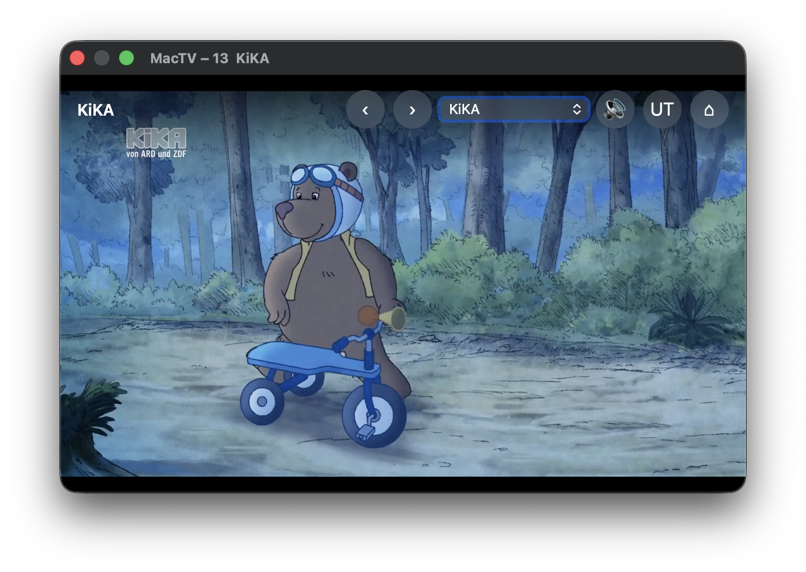
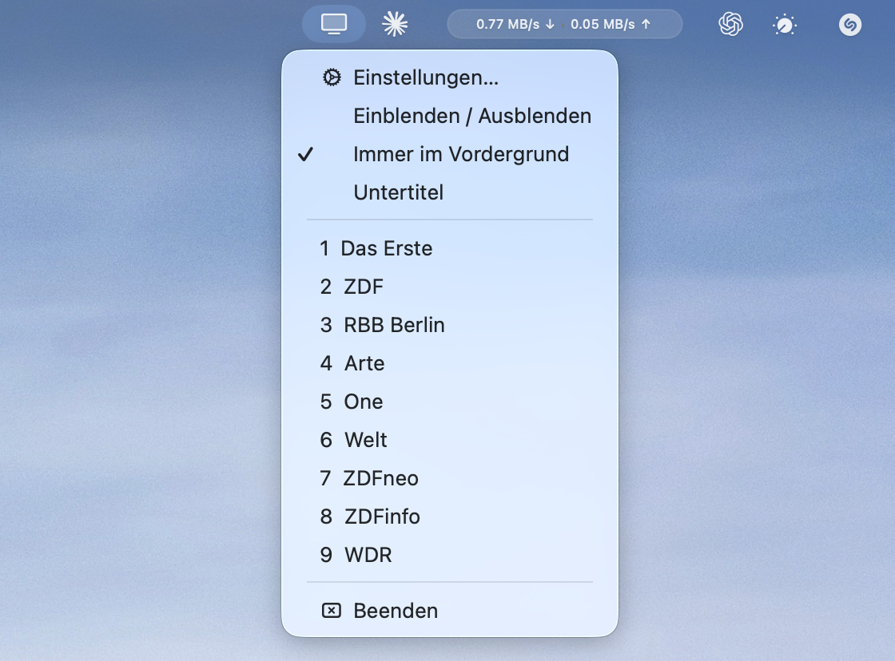
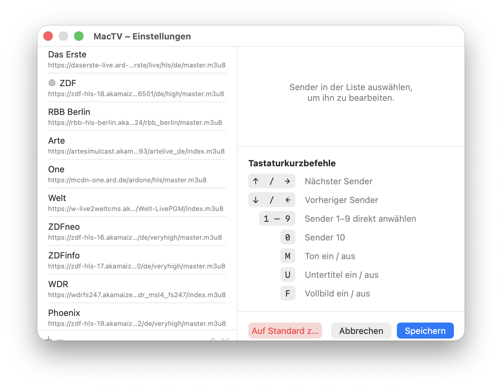

# MacTV

A lightweight macOS menu bar app for watching live German TV streams. Floats above all other windows — perfect as a small companion while working.

## Screenshots







## Features

- **26 live streams** — Das Erste, ZDF, Arte, ARD regional, and more
- **Floating window** — stays on top of all other windows (toggleable)
- **Keyboard control** — switch channels, mute, subtitles, fullscreen without touching the mouse
- **Menu bar icon** — quick access to channels, show/hide, and settings
- **Settings window** — add, remove, reorder channels with custom stream URLs
- **ZDF API** — dynamic stream URL fetching for ZDF (no hardcoded URL)
- **Subtitle toggle** — enable/disable subtitles per channel

## Keyboard Shortcuts

| Key | Action |
|-----|--------|
| `↑` / `→` | Next channel |
| `↓` / `←` | Previous channel |
| `1` – `9` | Jump to channel 1–9 |
| `0` | Jump to channel 10 |
| `M` | Mute / unmute |
| `U` | Subtitles on / off |
| `F` | Fullscreen on / off |
| `⌘W` | Hide window |
| `⌘Q` | Quit |

## Build

Requires macOS 13+ and Xcode Command Line Tools.

```bash
cd tv-mac
bash build.sh
```

The script compiles, bundles, and signs the app. Answer `j` at the prompt to launch immediately.

## Adding Custom Channels

Open **Settings** (`⌘,` or menu bar → Einstellungen) to add, remove, or reorder channels. Each channel needs a name and an HLS stream URL (`.m3u8`). Enable the **ZDF API** toggle for channels whose stream URL changes dynamically.
